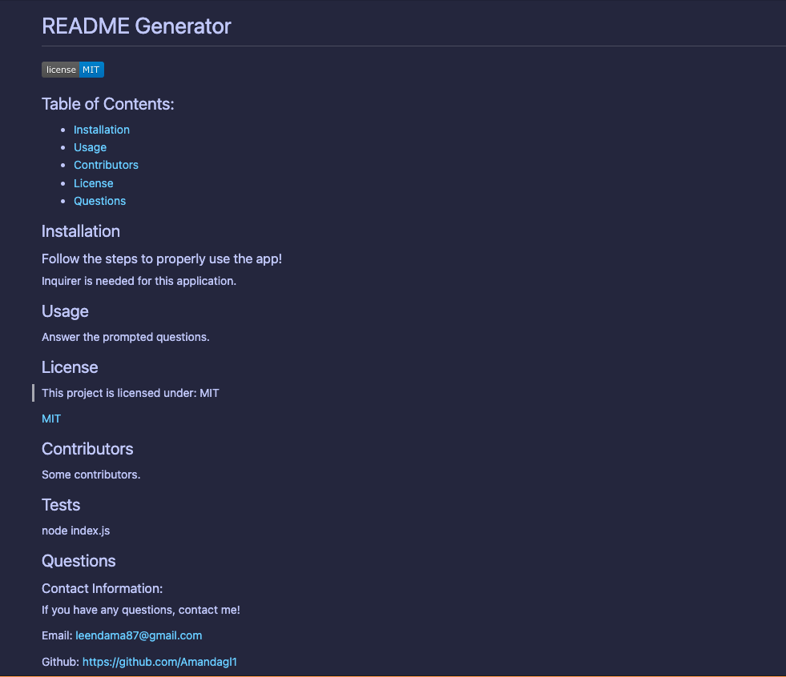

# Professional README Generator

## Description
- This project was created to make it easier for others to create their own README's.
- By running this command in an intergrated terminal, 
    ```
    node index.js
    ```
  the user will be given an array of questions that will generate a professional README.
- At the end of the prompt, a file named generated-README.md will return.

## Screenshot


## Demo
This video is a walkthrough demonstration of how you the README generator works!
